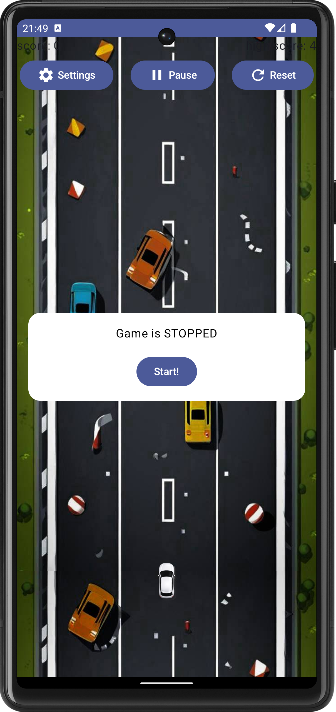
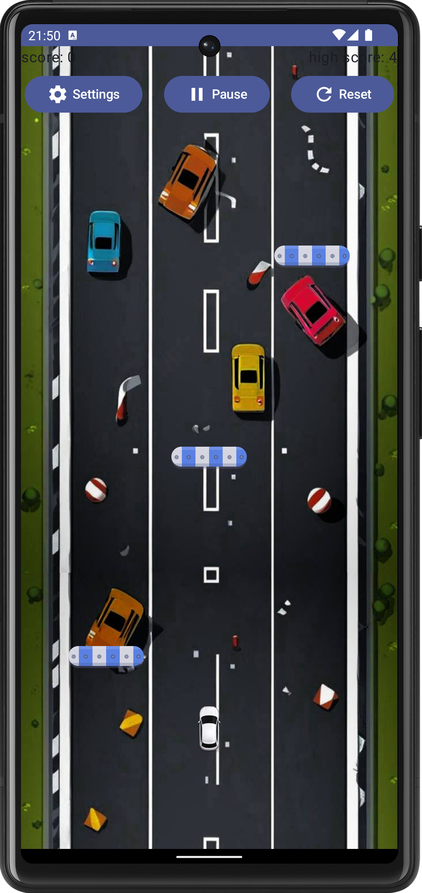
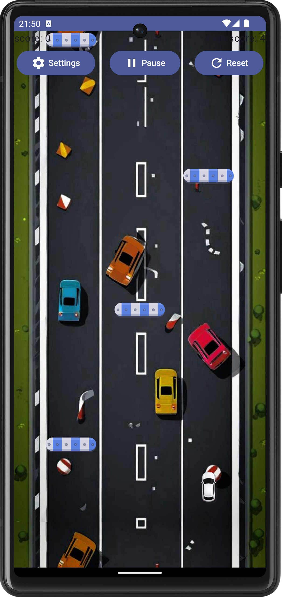
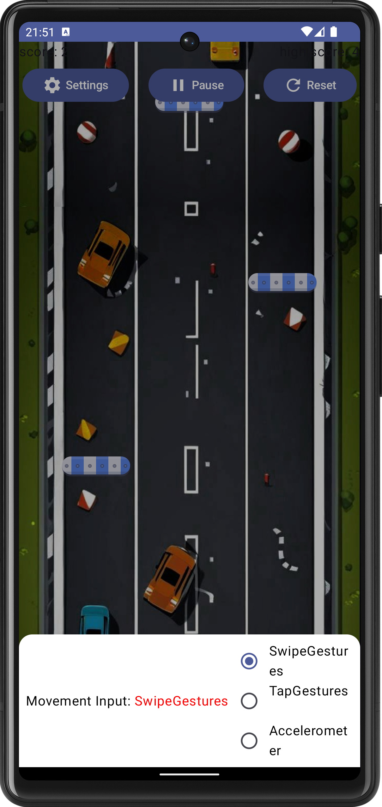
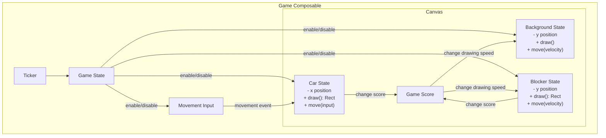

# Asphalt Android Game


 <div style="text-align:center"></div>


**Asphalt Android Game** is a simple yet engaging racing car game implemented using **Jetpack Compose** for the Android platform. The game includes dynamic movement, collision detection, and a scoring system, providing an immersive user experience.

---

## Demo

|||||

## Table of Contents

1. [Description](#description)
2. [Features](#features)
3. [Tech Stack](#tech-stack)
4. [Milestones](#milestones)
5. [Installation](#installation)
6. [Architecture](#architecture)
7. [Usage](#usage)
8. [License](#license)

---

## Description

Asphalt is a 2D racing game developed for Android using modern development tools and frameworks. The game features smooth animations, intuitive controls (accelerometer), and dynamic obstacles, delivering a polished mobile gaming experience.

---

## Features

- **Blocker Positioning**: Random and unique positions for blockers.
- **Movement Input**: Use the accelerometer to move the car.
- **Collision Detection**: Detect collisions between the car and blockers.
- **Highscore Tracking**: Save and display the player's high score.
- **Sound Effects**: Integrates immersive sound effects for events.

---

## Tech Stack

The game leverages the following tools and libraries:

### Languages and Frameworks
- **Kotlin**
- **Jetpack Compose**: Declarative UI development.

### Core Dependencies
- **Dagger Hilt**: Dependency Injection.
- **DataStore**: Save game preferences and high scores.
- **Accompanist**: Material navigation.
- **Compose BOM**: Core Compose dependencies.
- **Hilt Navigation Compose**: Integration of Hilt with Jetpack Navigation Compose.

### Testing
- **JUnit**: Unit testing.
- **Espresso**: UI testing.
- **Compose UI Test**: Testing Compose UI components.

### Tools
- **Gradle**: Build tool.
- **Proguard**: Code shrinking for production.

---

## Milestones

The following milestones define the game development:

1. **Blocker Unique Positioning**: Randomized blockers on the canvas.
2. **Movement via Accelerometer**: Use device sensors for car movement.
3. **Collision Detection**: Real-time detection of collisions.
4. **Highscore Tracking**: Persistent highscore system.
5. **Sound Effects**: Add audio for in-game events.

---

## Installation

Follow these steps to set up the project:

### Prerequisites
- Android Studio oder IntelliJ IDEA (Latest version)
- Gradle (Kotlin Gradle Plugin) (Integrated with Android Studio)
- Kotlin 1.8 or higher
- Minimum **Android SDK 24**

### Steps
1. **Clone the Repository**
   ```bash
   git clone https://github.com/michigang1/asphalt-android-game.git
   ```

2. **Open Project in Android Studio or IntelliJ IDEA **
    - Open the folder using Android Studio.
    - Let Gradle sync all dependencies.

3. **Run the App**
    - Connect an Android device or use an emulator.
    - Run the project using play button.

---

## Architecture

The game's architecture consists of modular and composable components. Below is the visual representation:



### Explanation
1. **Ticker**: Controls the game tick rate, including speed.
2. **Game State**: Manages game status (running/paused).
3. **Game Score**: Tracks and updates scores.
4. **Movement Input**: Receives player input via accelerometer or other controls.
5. **Canvas**: Draws the game components:
    - **Background State**: Background visuals.
    - **Blocker State**: Obstacles.
    - **Car State**: Player's car position and movement.

---

## Usage

- **Start the Game**: Launch the app and start the game using the "Start!" button.
- **Move the Car**: Tilt your device left or right to avoid blockers
(There are 3 movement controls: via swipes, via taps and via accelerometer).
- **Game Over**: When the car collides with a blocker, the score nulls.
- **High Score**: Your highest score is saved and displayed.

---

## License

This project is licensed under the **Apache-2.0**. See the LICENSE file for details.

---

## Contributions

Contributions are welcome! If you'd like to improve the game or add features, follow these steps:

1. Fork the repository.
2. Create a new branch.
3. Commit and push your changes.
4. Open a pull request.

---

## Acknowledgements

Special thanks to the open-source community and tools used in this project:
- Jetpack Compose
- Dagger Hilt

---

Enjoy the game, and happy coding! 🚗💨

